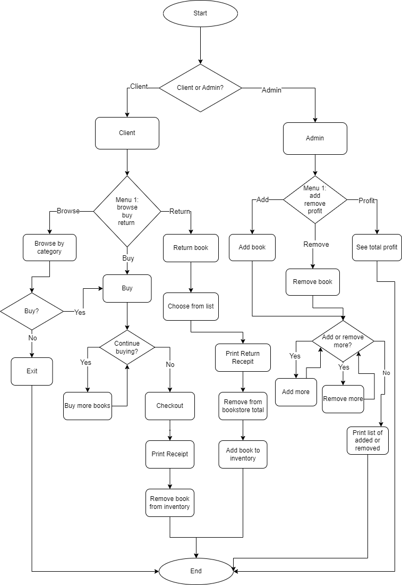

# Welcome to Python Bookstore

We are pleased to have you here :smile:!

This is a simple Python project, meant to help me develop my programming skills. This is a simple online bookstore, where the user/client buys books. It has an inventory, prices, discount prices, and prints a receipt.

## Table of contents

- [Basic Features](#basic-features)
- [Flowchart](#flowchart)
- [Updates](#updates)
- [Links](#links-and-resources)

## Basic Features

Basic features include:

- Add books to inventory
- Remove book from inventory when purchased
- Calculate the bookstore’s total profit
- Calculate total + shipping
- Offer free shipping when it reaches a certain value
- Add book to inventory when returned
- Subtract from the bookstore’s profits when a book is returned
- Print receipt

## Flowchart

## Updates

## Links and Resources
- [Twitter](https://twitter.com/v_chipeja)
- [LinkedIn](https://www.linkedin.com/in/ivana-chipeja/)

