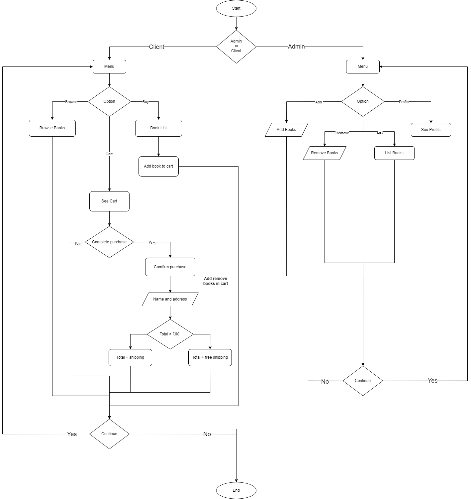

# Welcome to Python Bookstore

We are pleased to have you here :smile:!

This is a simple Python project, meant to help me develop my programming skills. This is a simple online bookstore, where the user/client buys books. It has an inventory, prices, discount prices, and prints a receipt.

## Table of contents

- [Basic Features](#basic-features)
- [Flowchart](#flowchart)
- [Updates](#updates)
- [Links](#links-and-resources)

## Basic Features

Basic features include:

- Add books to inventory
- List books
- Remove books
- Remove copy of a book when purchased (stock)
- Calculate the bookstore’s total profit
- Calculate total + shipping
- Offer free shipping when it reaches a certain value
- Print receipt

## Flowchart

## Updates
- Separated Client and Admin into two modules for better redability and organisation
- Removed the return fucntion
- Decided to use dictionaries and add them to a list
- Updated the flowchart
- Fixed the menu loop

## Links and Resources
- [Twitter](https://twitter.com/v_chipeja)
- [LinkedIn](https://www.linkedin.com/in/ivana-chipeja/)
- [Day 14 Project: Reading List](https://teclado.com/30-days-of-python/python-30-day-14-project-regular/)

